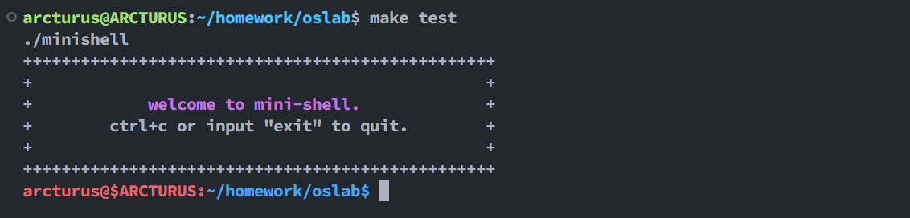
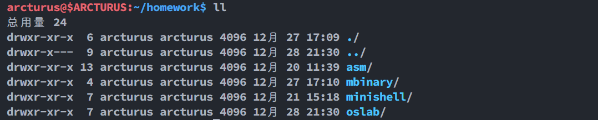
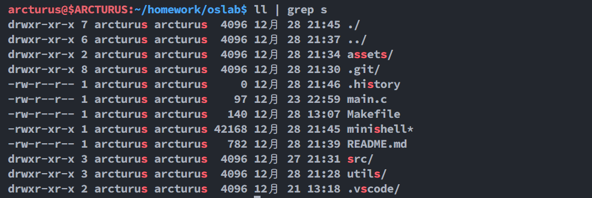
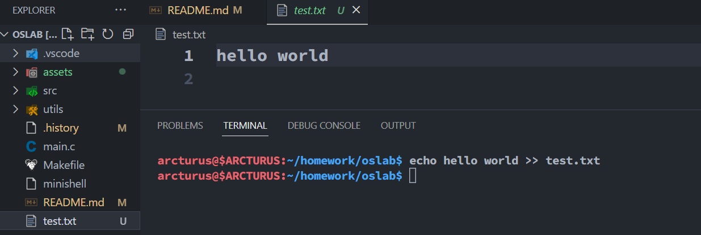
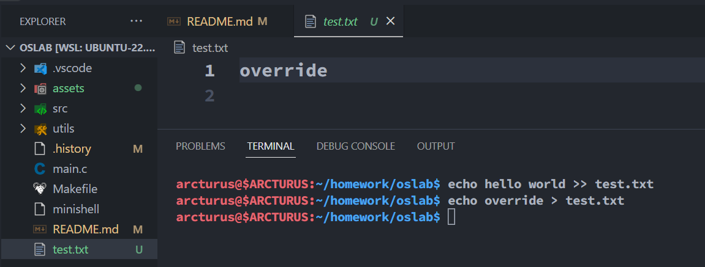
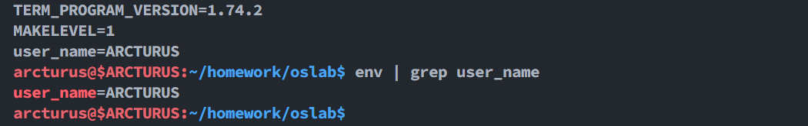
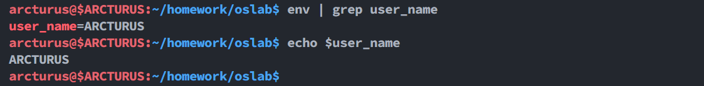
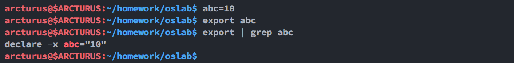
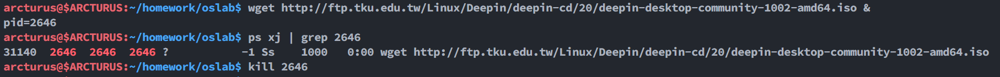

# MiniShell 的设计与实现

操作系统课程设计

## 实验目标

- [x] 支持后台符号 `&`
- [x] 支持串行执行多个命令 `;`
- [x] 支持管道 `|`
- [x] 支持环境变量 `export` `env`
- [x] 支持字符串的输出 `echo`
- [x] 重定向 `>>` `>` `<`
- [x] 支持变量 `$`
- [x] 支持历史 `history`
- [x] 支持 `alias`

## 编译

```bash
make build
```

## 测试

```bash
make test
```



### 串行执行

```bash
date;ls;cd ..
```


### 命令别名

```bash
ll # ls -alF --color=auto
```



### 历史命令

```bash
history
```

删除历史命令

```bash
history -c
```

将内存中的命令写入 `.history` 文件中

```bash
history -a
```


### 管道

```bash
ll | grep s
```



### 输入输出重定向

```bash
echo hello world >> test.txt
```



```bash
echo override > test.txt
```



```bash
wc -l < README.md
```


### 环境变量

```bash
env user_name=ARCTURUS
```

```bash
env | grep user_name
```



输出环境变量

```bash
echo $user_name
```



shell 变量导出

```bash
abc=10
```

```bash
export abc
```

```bash
export | grep abc
```



### 后台运行

```bash
wget http://ftp.tku.edu.tw/Linux/Deepin/deepin-cd/20/deepin-desktop-community-1002-amd64.iso &
```

查看守护进程

```bash
ps xj | grep xxx
```



## 设计

### 命令别名

```c
typedef struct Alias {
    char* alias;        // 指令别名
    char* real;         // 实际指令
    char** args;        // 默认参数
    struct Alias* next; // 别名链表
} Alias;
```

首先是先定义一些默认的别名

```c
char* ll[]   = { "-alF", "--color=auto", NULL };
// ...
```

然后在处理指令的时候将用户输入与默认的别名进行合并

```c
void alias_handler(char*** c) {
    Alias* a = search_alias((*c)[0]); // 搜索已定义别名

    if (NULL != a) {
        int len = array_len(*c) + max_default_args_len;

        char** t = (char**)malloc(sizeof(char*) * len);
        add_recycle(t);

        t[0] = a->real; // 实际的命令

        // 合并默认参数
        int i = 0;
        while (a->args[i]) {
            t[i + 1] = a->args[i];
            i++;
        }

        int j = i + 1;

        i = 1;

        // 合并用户输入参数
        while ((*c)[i]) {
            t[j++] = (*c)[i++];
        }

        t[j] = NULL;

        (*c) = t;
    }
}
```

### 输入历史

首先定义一个保存在内存中的指令输入双向链表

```c
typedef struct cmdLink {
    char* cmd;            // 输入指令
    int id;               // 第几条指令
    struct cmdLink* next; // 下一条指令
    struct cmdLink* pre;  // 上一条指令
} cmdLink;
```

然后直接遍历内存中的双向链表即可实现历史记录的访问, 之所以要双向链表是为了方便访问最近几条数据, 因为插入的时候为了方便采用的是 `头插` , 这样访问最近几条数据会很方便, 但是要访问全部数据, 就要先遍历到开头, 然后再翻转链表, 十分麻烦, 所以采用双向链表

```c
void show_history(int num) {
    if (num < 0) {
        // 如果需要显示全部的历史, 从头开始遍历
        cmdLink* link = start;

        while (link) {
            fprintf(stdout, "%d %s", link->id, link->cmd);
            link = link->next;
        }

    } else {
        // 防止显式指定的历史数超过实际历史数
        int n = num < cmd_num ? num : cmd_num;

        cmdLink* link = end; // 需要从最近的一条历史往回找

        for (int i = 0; i < n - 1; i++) {
            link = link->pre;
        }

        for (int i = 0; i < n; i++) {
            fprintf(stdout, "%d %s", link->id, link->cmd);
            link = link->next;
        }
    }
}
```

### 后台运行

这段程序实现了 linux 下的 `守护进程` , 也就是不会出现在控制台中, 而是脱离了父进程

```c
void init_daemon() {
    pid_t pid;

    if ((pid = fork()) < 0) {
        show_error(true, "create a new process failed");
    } else if (pid != 0) {
        exit(EXIT_SUCCESS);
    }

    printf("pid=%d\n", getpid()); // 输出当前进程的 pid, 方便用户 kill

    setsid(); // 建立一个新的进程组

    // 关闭所有从父进程继承的不再需要的文件描述符
    for (int i = 0; i < NOFILE; close(i++))
        ;

    // 忽略终端 I/O 信号, STOP 信号
    signal(SIGTTOU, SIG_IGN);
    signal(SIGTTIN, SIG_IGN);
    signal(SIGTSTP, SIG_IGN);
    signal(SIGHUP, SIG_IGN);

    umask(0); // 将文件当时创建屏蔽字设置为 0

    signal(SIGCHLD, SIG_IGN); // 忽略 SIGCHLD 信号
}
```

一开始看[这篇博客](https://mbinary.xyz/simple-shell.html#9-%E5%AE%9E%E7%8E%B0%E9%87%8D%E5%AE%9A%E5%90%91%E4%B8%8E%E7%AE%A1%E9%81%93%E2%80%94-lt-gt-gt-gt)的时候上面说实现后台运行直接显式的开启或关闭父进程的 `wait` 即可, 一开始我是像下面这样写的, 然而并没有效果, 子进程的输出依旧会出现在控制台中, 并且和父进程的输出混淆在了一起, 这并不是我想要的效果, 所以最后采用了守护进程的方案

```c
if (c->back) {
    wait(&status);
}
```

### 管道

这个麻烦死了, 首先要创建一个父进程, 子进程还要再创建一个孙子进程, 这样才能在子进程中实现描述符共享

```c
// 父进程
pid_t pid = fork();

if (pid < 0) {
    show_error(true, "create a new process failed");
} else if (0 == pid) {
    run_command(c);  // 执行指令
} else {
    wait(NULL);
}
```

```c
int pipe_fd[2] /* 描述符 */, status;

if (pipe(pipe_fd) < 0) {
    show_error(true, "create pipe failed");
}

pid_t pid = fork(); // 子进程创建孙子进程

if (pid < 0) {
    show_error(true, "create a new process failed");
} else if (0 == pid) {
    set_redirect(c->redirect, c->path);  // 输入输出重定向

    // 管道重定向
    close(pipe_fd[0]);
    if (-1 == dup2(pipe_fd[1], STDOUT_FILENO)) {
        show_error(false, "dup2 failed");
    }

    if (is_builtin(c->cmd)) {
        exec_builtin(c);
    } else if (-1 == execvp(c->cmd, c->args)) {
        fprintf(stderr, "command execution failed.\n");
    }
} else {
    wait(&status);  // 等待前一条指令执行结束

    // 给下一条指令设置输入流
    close(pipe_fd[1]);
    if (-1 == dup2(pipe_fd[0], STDIN_FILENO)) {
        show_error(false, "dup2 failed");
    }

    run_command(c->p); // 执行下一条指令
}
```

### 输入输出重定向

这个比较简单, 使用 `c` 语言的标准库函数 `dup2` 即可实现

```c
void set_redirect(Direct dir, char* path) {
    if (path != NULL) {
        if (dir == R_RIGHT || dir == R_DRIGHT) {  // > or >>
            int flag;

            if (dir == R_RIGHT) {
                flag = O_WRONLY | O_TRUNC | O_CREAT;
            } else {
                flag = O_WRONLY | O_APPEND | O_CREAT;
            }

            int wport = open(path, flag, 0644);
            dup2(wport, STDOUT_FILENO);
            close(wport);
        } else if (dir == R_LEFT) {  // <
            int rport = open(path, O_RDONLY);
            dup2(rport, STDIN_FILENO);
            close(rport);
        }
    }
}
```

### 关于变量

```c
typedef struct var {
    char* key;         // 变量的键
    char* value;       // 变量的值
    int is_env;        // 是否是环境变量
    struct var* next;  // 下一个变量
} var;
```

通过一个链表将 `shell` 中定义的变量串起来, 当用户输入 `$xxx` 的时候, 去链表中搜索 `xxx` 即可获取变量值, 当然这里最好使用 `map` , 但是为了图方便, 直接使用了链表

```c
var* search_var(char* key) {
    var* p = node;

    while (p) {
        if (strequ(key, p->key)) {
            return p;
        }

        p = p->next;
    }

    return NULL;
}
```

```c
while (args[i] != NULL) {
    // 去掉用户输入的双引号
    c = strtrim(args[i], "\"", BOTH, true);

    // 判断输入中是否带有变量
    char* p = strstr(c, "$");

    if (p != NULL) {
        // 搜索变量, 查看是否已经定义过
        var* v = search_var(p + 1);

        char* t;

        if (v != NULL) {
            // 已经定义过变量, 则将其与替换
            t = (char*)malloc(sizeof(char) * (p - c + strlen(v->value) + 1));
            strncpy(t, c, p - c);
            t[p - c] = '\0';
            strcat(t, v->value);
        } else {
            // 没定义过, 则原样输出
            t = (char*)malloc(sizeof(char) * (p - c + 1));
            strncpy(t, c, p - c);
            t[p - c] = '\0';
        }

        new = strjoin(msg, t, " "); // 拼接用户输入

    } else {
        new = strjoin(msg, c, " ");
    }

    msg = new;
    i++;
}
```

## 心得体会

虽然有一小部分在平时作业中写过, 缩减了一些工作量, 但为了方便后续的工作, 几乎重构了原来的代码, 包括自定义了一些字符串操作, 如 `strrepl` `startswith` `strtrim` `strsplit` 等等, 查阅了一些关于后台运行、管道的相关操作, 都是云里雾里, 整整用了四五天才把本项目写完, 但还是有很多不完善的方面, 即 `shell` 的后台运行 `&` 其实并不是以守护进程的形式, 它会把一些东西放到前台显示, 有些放到后台, 比如 `ps &` 就会立即在控制台显示结果, 而 `top &` 并不会, 以及管道操作的时候, 内部命令如何与外部命令一起操作, 内部命令不应该放在 `fork` 中, 但是不放在 `fork` 中如何使用管道呢? 如果放在 `fork` 中, 由于内部命令会修改全局变量, 但子进程和父进程的全局变量是不共享的, 需要使用共享内存或者管道等等技术, 由于时间有限, 懒得弄了, 以后有时间再说。🤗
